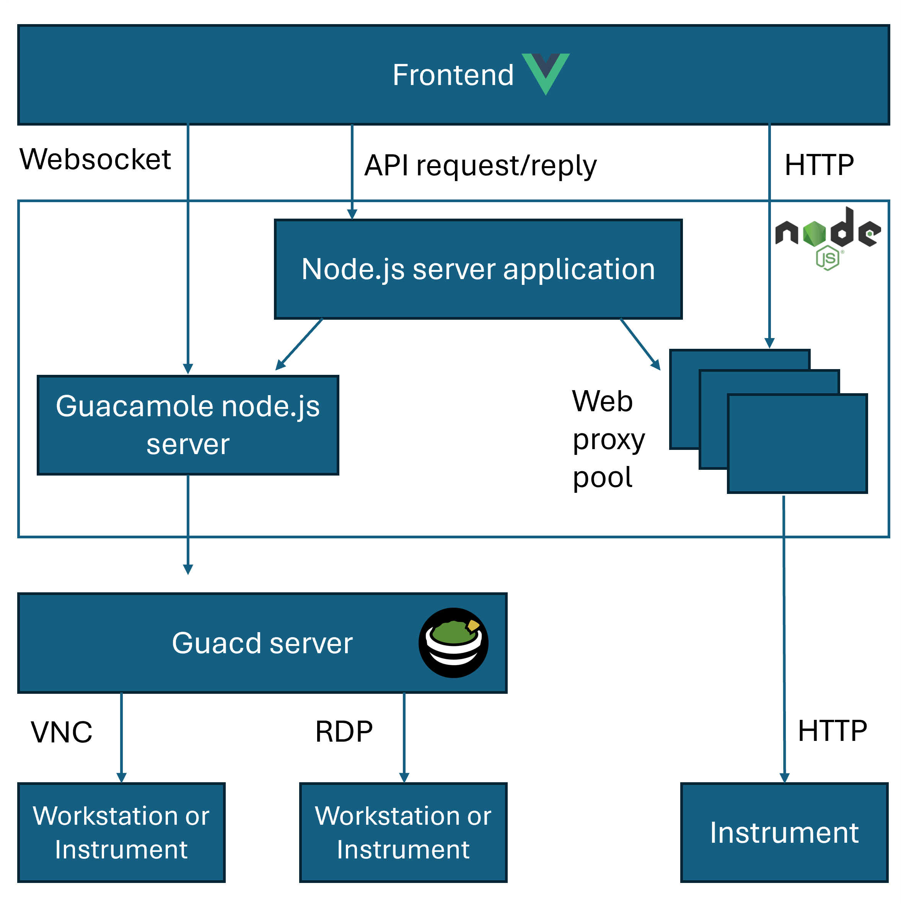

# Remote laboratory

This project aims to develop a laboratory server for providing remote experiments using actual instrumentation.
Three options of interface are planned:

- VNC or RDP (useful for workstations and Windows-based instrumentation);
- web (many recent instruments provide a remote panel accessible through web, e.g. Tektronix eScope)
- VISA (to be implemented)

The architecture of the laboratory server is shown in the figure below.
A frontend, implemented in Vue, is in charge of interacting with the users. 
The frontend sends then API requests to the backend server which is in charge of:
- managing user authentication;
- providing the list of experiments, and the list of resources (instruments, workstations, etc.) used by the experiment;
- starting and stopping an experiment.

If a resource requires a remote desktop connection, the server application sends a token to the frontend, to be used in a websocket connection with the Guacamole server.

If a resource requires a web connection, the server application starts a web proxy pointing to the resource and sends a token to the frontend to be used with the web proxy.

## Installation

Guacamole server is required to support VNC and RDP interface.
It can be run from a docker container or built by source code.

### Guacd docker
The easiest way to run guacd is to use the official Docker image:

    docker run --name guacd -d -p 4822:4822 guacamole/guacd

### Guacamole-server build and install
To build Guacamole-server, first we need to ensure the needed packages are installed.
This can be done in a debian-based distribution by installing the needed packages by apt:
    sudo apt install libcairo2-dev libjpeg62-turbo-dev libpng-dev libpng16-16 libossip-uuid-dev freerdp2-dev libssh2-1-dev libtelnet-dev libpango1.0-dev libvncserver-dev libpulse-dev libssl-dev libwebp-dev

Please check that autoconf and libtool are properly installed. Otherwise:
    sudo apt install autoconf libtool

Download the latest release on Github. Untar the archive.
    wget -c https://github.com/apache/guacamole-server/archive/1.5.5.tar.gz
    tar xfvz guacamole-server-1.5.5.tar.gz
    cd guacamole-server-1.5.5

Configure and compile the server:

    autoreconf -fi
    ./configure --with-init-dir=/etc/init.d
    make
    make install
    ldconfig
    systemctl enable guacd
    systemctl start guacd

## Deployment

### frontend
1. Change localhost to the host address in the environment variable VITE_HOST_ADDRESS in .env file
2. Build Vue application:
    npm run build
3. Copy the content of the generated dist folder to the websiet folder (e.g. /var/www/html/)

### backend
Start the node server:
    npm start

